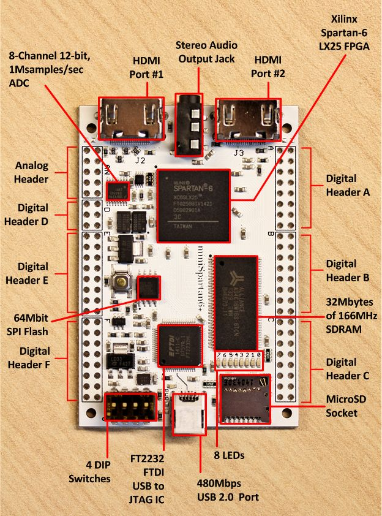

# miniSpartan6+ (Spartan6) FPGA based MP3 Player

Github:   [https://github.com/ultraembedded/minispartan6-audio](https://github.com/ultraembedded/minispartan6-audio)

An audio player (MP3) based on the Scarab Hardware miniSpartan6+ FPGA board featuring my RISC-V CPU, SDRAM controller and peripherals.

## Cloning
```
# Clone repository and submodules
git clone https://github.com/ultraembedded/minispartan6-audio.git --recursive
```

## Features
* 50MHz RISC-V (RV32IM) CPU with ICACHE (2-way x 8KB), DCACHE (2-way x 8KB write-back).
* AXI4 infrastructure.
* SDRAM controller.
* SPI (SD card) interface.
* 2-ch audio controller (sigma delta DAC).
* UART -> AXI debug bridge (for loading code, etc).

## Details

I originally created a FPGA soft-CPU based MP3 player around a MIPS derivative in 2012 ([Hackaday](https://hackaday.com/2012/03/13/playing-mp3s-from-an-fpga/))

This time, I've rebuilt it around my RISC-V (RV32IM) CPU, SDRAM controller and SoC peripherals;

| Component | Description   |
| ---- | ------------- |
| [audio](https://github.com/ultraembedded/core_audio) | Audio Controller and FIFO |
| [core_soc](https://github.com/ultraembedded/core_soc) | SoC peripherals (timer, SPI, GPIO, UART) |
| [dbg_bridge](https://github.com/ultraembedded/core_dbg_bridge) | UART -> AXI debug bridge |
| [riscv](https://github.com/ultraembedded/riscv) | RISC-V (RV32IM) |
| [sdram](https://github.com/ultraembedded/core_sdram_axi4) | AXI4 SDRAM Controller |

The application code will play any MP3s found in the root directory of a FAT32 formatted SD card placed in the microSD card slot of the FPGA dev board.

## Scarab Hardware miniSpartan6+


## ISE Design Summary (XC6LX9)
```
Design Summary
--------------

Design Summary:
Number of errors:      0
Number of warnings:   10
Slice Logic Utilization:
  Number of Slice Registers:                 2,670 out of  11,440   23%
    Number used as Flip Flops:               2,670
    Number used as Latches:                      0
    Number used as Latch-thrus:                  0
    Number used as AND/OR logics:                0
  Number of Slice LUTs:                      5,694 out of   5,720   99%
    Number used as logic:                    5,142 out of   5,720   89%
      Number using O6 output only:           3,958
      Number using O5 output only:             261
      Number using O5 and O6:                  923
      Number used as ROM:                        0
    Number used as Memory:                     519 out of   1,440   36%
      Number used as Dual Port RAM:            518
        Number using O6 output only:            70
        Number using O5 output only:            14
        Number using O5 and O6:                434
      Number used as Single Port RAM:            0
      Number used as Shift Register:             1
        Number using O6 output only:             1
        Number using O5 output only:             0
        Number using O5 and O6:                  0
    Number used exclusively as route-thrus:     33
      Number with same-slice register load:     21
      Number with same-slice carry load:        12
      Number with other load:                    0

Slice Logic Distribution:
  Number of occupied Slices:                 1,430 out of   1,430  100%
  Number of MUXCYs used:                     1,288 out of   2,860   45%
  Number of LUT Flip Flop pairs used:        5,710
    Number with an unused Flip Flop:         3,194 out of   5,710   55%
    Number with an unused LUT:                  16 out of   5,710    1%
    Number of fully used LUT-FF pairs:       2,500 out of   5,710   43%
    Number of unique control sets:             216
    Number of slice register sites lost
      to control set restrictions:             881 out of  11,440    7%

  A LUT Flip Flop pair for this architecture represents one LUT paired with
  one Flip Flop within a slice.  A control set is a unique combination of
  clock, reset, set, and enable signals for a registered element.
  The Slice Logic Distribution report is not meaningful if the design is
  over-mapped for a non-slice resource or if Placement fails.

IO Utilization:
  Number of bonded IOBs:                       147 out of     186   79%
    Number of LOCed IOBs:                      147 out of     147  100%
    IOB Flip Flops:                             61

Specific Feature Utilization:
  Number of RAMB16BWERs:                        22 out of      32   68%
  Number of RAMB8BWERs:                          2 out of      64    3%
  Number of BUFIO2/BUFIO2_2CLKs:                 1 out of      32    3%
    Number used as BUFIO2s:                      1
    Number used as BUFIO2_2CLKs:                 0
  Number of BUFIO2FB/BUFIO2FB_2CLKs:             0 out of      32    0%
  Number of BUFG/BUFGMUXs:                       1 out of      16    6%
    Number used as BUFGs:                        1
    Number used as BUFGMUX:                      0
  Number of DCM/DCM_CLKGENs:                     0 out of       4    0%
  Number of ILOGIC2/ISERDES2s:                  17 out of     200    8%
    Number used as ILOGIC2s:                    17
    Number used as ISERDES2s:                    0
  Number of IODELAY2/IODRP2/IODRP2_MCBs:         0 out of     200    0%
  Number of OLOGIC2/OSERDES2s:                  44 out of     200   22%
    Number used as OLOGIC2s:                    44
    Number used as OSERDES2s:                    0
  Number of BSCANs:                              0 out of       4    0%
  Number of BUFHs:                               0 out of     128    0%
  Number of BUFPLLs:                             0 out of       8    0%
  Number of BUFPLL_MCBs:                         0 out of       4    0%
  Number of DSP48A1s:                            4 out of      16   25%
  Number of ICAPs:                               0 out of       1    0%
  Number of MCBs:                                0 out of       2    0%
  Number of PCILOGICSEs:                         0 out of       2    0%
  Number of PLL_ADVs:                            1 out of       2   50%
  Number of PMVs:                                0 out of       1    0%
  Number of STARTUPs:                            0 out of       1    0%
  Number of SUSPEND_SYNCs:                       0 out of       1    0%
```

## Running Firmware

To build the firmware, make sure the RISC-V GCC (built for RV32IM) are in the PATH, then type:
```
# Add RISC-V GCC to path
export PATH=$PATH:/opt/riscv32im/bin/

# Build firmware
make
```

The FPGA board has a FTDI dual channel FT2232H where channel A (usually /dev/ttyUSB1) is used for loading the bitstream, and channel B (usually /dev/ttyUSB2) is used for a virtual serial port.

The tools provided for loading the firmware need to be pointed at channel B, e.g;

```
make run TARGET_PORT=/dev/ttyUSB2

ELF: Loading 0x80000000 - size 79KB
 |XXXXXXXXXXXXXXXXXXXXXXXXXXXXXXXXXXXXXXXXXXXXXXXXXX| 100.0% 

SD Test

Directory /
01  Kaiser Chiefs - Ruby.mp3 [3284992 bytes]
02  Kaiser Chiefs - The Angry Mob.mp3 [4616192 bytes]
03  Kaiser Chiefs - Heat Dies Down.mp3 [3796992 bytes]
04  Kaiser Chiefs - Highroyds.mp3 [3196928 bytes]
05  Kaiser Chiefs - Love's Not A Competition [But I'm Winning].mp3 [3168256 bytes]
06  Kaiser Chiefs - Thank You Very Much.mp3 [2527232 bytes]
07  Kaiser Chiefs - I Can Do Without You.mp3 [3270656 bytes]
08  Kaiser Chiefs - My Kind Of Guy.mp3 [3948544 bytes]
09  Kaiser Chiefs - Everything Is Average Nowadays.mp3 [2639872 bytes]
10  Kaiser Chiefs - Boxing Champ.mp3 [1460224 bytes]
11  Kaiser Chiefs - Learnt My Lesson Well.mp3 [3762176 bytes]
12  Kaiser Chiefs - Try Your Best.mp3 [3563520 bytes]
13  Kaiser Chiefs - Retirement.mp3 [3739648 bytes]
01  The Chemical Brothers - No Path To Follow.mp3 [1523295 bytes]
02  The Chemical Brothers - We Are The Night.mp3 [9431501 bytes]
03  The Chemical Brothers - All Rights Reversed.mp3 [6775161 bytes]
04  The Chemical Brothers - Saturate.mp3 [6929388 bytes]
05  The Chemical Brothers - Do It Again.mp3 [7997065 bytes]
06  The Chemical Brothers - Das Spiegel.mp3 [8390156 bytes]
07  The Chemical Brothers - The Salmon Dance.mp3 [5248565 bytes]
08  The Chemical Brothers - Burst Generator.mp3 [9914244 bytes]
09  The Chemical Brothers - A Modern Midnight Conversation.mp3 [8560056 bytes]
10  The Chemical Brothers - Battle Scars.mp3 [8417114 bytes]
11  The Chemical Brothers - Harpoons.mp3 [3482479 bytes]
12  The Chemical Brothers - The Pills Won't Help You Now.mp3 [9438397 bytes]
Playing '/01  Kaiser Chiefs - Ruby.mp3'..
```

The python firmware loader tools require access to the serial port (user permissions), python-serial and ELF libraries;

```
# Pip install of required python libraries
pip install pyserial --upgrade
pip install pyelftools --upgrade

# (or) Ubuntu/Debian/Mint python libraries install
sudo apt-get install python-serial python-pyelftools
```
